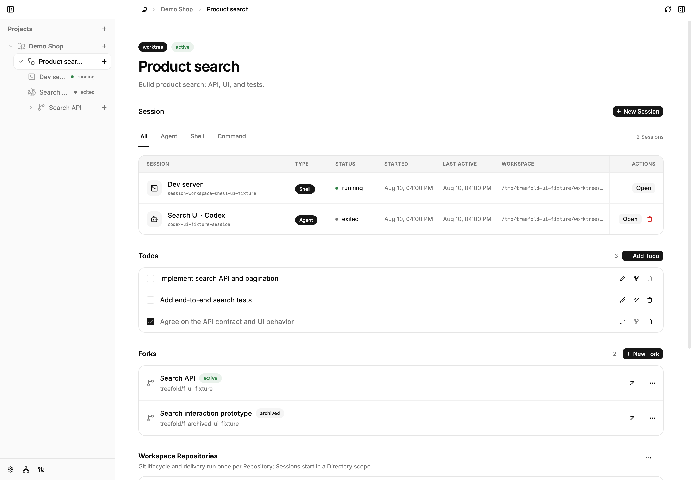
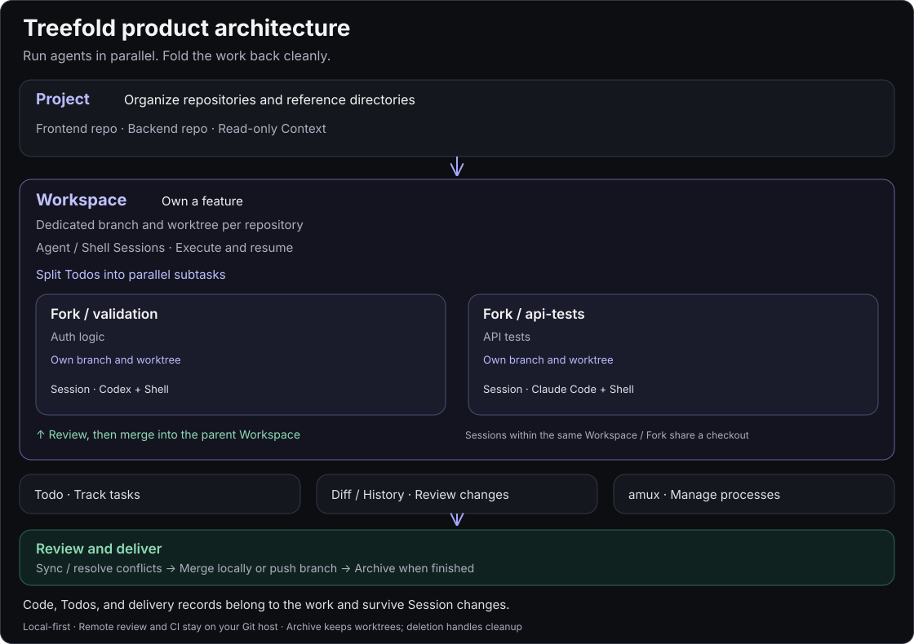
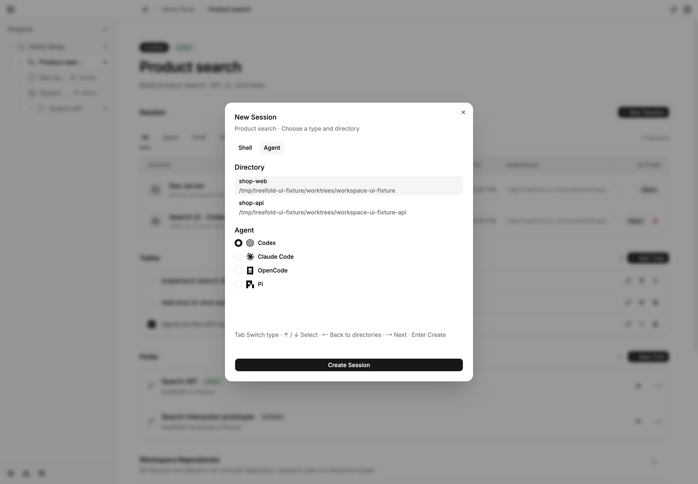

# Treefold for macOS

[简体中文](README.md) | **English**

**Run agents in parallel. Fold the work back cleanly.**

Treefold is a local-first macOS app for running AI agents in isolated Git worktrees. Keep code, terminals, and tasks together, then merge the results back into your main line of work.

Develop with **Codex, Claude Code, OpenCode, or Pi**, and use Shell Sessions to run services and tests. Each feature gets its own Workspace, so you can switch tasks without repeatedly switching branches, finding terminals, or reconstructing your progress.

[Install](#install) · [Start your first task](#start-your-first-task) · [Common workflows](#common-workflows) · [Website](https://treefold.fffeng566.workers.dev/) · [GitHub Releases](https://github.com/win5do/treefold/releases)



*App UI captured from the current source with sample data. Released versions may look different.*

## What you can do with Treefold

- **Work on several features at once.** Each Workspace gets its own branches and worktrees, preserving your existing checkout.
- **Delegate parallel subtasks.** Create Forks within a Workspace so different agents can work on the API, UI, or tests, then merge into the parent Workspace.
- **Keep your context.** Code, Agent and Shell Sessions, and Todos stay attached to their task. Page navigation does not stop processes; Agent Sessions linked to native history can be resumed.
- **Review and deliver.** Inspect diffs and Git history, handle synchronization and conflicts, choose a local merge or branch push, then archive and clean up when ready.
- **Organize multiple repositories.** Group frontend and backend repositories with reference documents in one Project, with explicit read/write roles for directories.

## Product architecture

Projects organize repositories, Workspaces own features, and Forks isolate subtasks in dedicated worktrees. Agent and Shell Sessions execute the work. Review and merge Fork results into the parent Workspace, then deliver the feature.



Isolation belongs to the Workspace / Fork. Sessions within the same work share a checkout. Code, Todos, and delivery records survive Session changes.

## Install

You need an **Apple Silicon Mac running macOS Sonoma 14 or newer, plus Git**.

### Homebrew

```bash
brew install --cask win5do/tap/treefold
```

Open Treefold from Applications. To update later:

```bash
brew update
brew upgrade --cask treefold
```

### Download the app

Visit [GitHub Releases](https://github.com/win5do/treefold/releases), download the Apple Silicon `.dmg`, open it, and drag Treefold into Applications. Release pages also provide a ZIP archive, SHA-256 checksums, and release notes.

The current release is **0.1.0-alpha.1**. It is ad-hoc signed and has not been notarized by Apple. If macOS blocks the first launch, choose Open Anyway in System Settings → Privacy & Security, then confirm when prompted.

### Set up your agents

Treefold runs locally installed Agent CLIs. Install the ones you want to use, complete their login or model configuration, and confirm they work in your terminal.

| Agent | Default command |
| --- | --- |
| Codex | `codex` |
| Claude Code | `claude` |
| OpenCode | `opencode` |
| Pi | `pi` |

Open **Settings → Agents** to check detection, reorder agents, or customize launch commands. Use Recheck Agents if a newly installed CLI does not appear; for a custom installation location, enter the executable's absolute path. Shell Sessions work independently without an Agent configured.

All four agents support new Sessions and resuming linked native Sessions. Resume requires a recorded native Session ID and retained history; see [Agent Session details](docs/agent-session-metadata.md) for integration requirements.



## Start your first task

Start with **one Project → one Workspace → one Agent Session**. You can add Forks later.

1. **Add a Project.** Choose New Project and select an existing local repository, clone a Git URL, or create an empty repository. For a directory containing multiple repositories, select the repositories and reference directories to include.
2. **Create a Workspace.** Name the task, such as “Product search.” Treefold prepares separate branches and worktrees for development.
3. **Start an Agent.** Create a Session in the Workspace, select Agent, choose a CLI and working directory, then describe the task in its terminal. For example: “Add search to the product list. Inspect the existing API and tests first, then implement and verify it.”
4. **Run and review.** Open a Shell Session to install project dependencies, start services, or run tests. Review diffs and Git history in Treefold to check the changes.
5. **Deliver and archive.** Open the delivery flow and choose to merge into the Project checkout's current branch or push the feature branch for remote review. Use intermediate delivery to keep developing, or finish and archive when the task is complete.

Finishing and archiving stops the associated Sessions while retaining worktrees, branches, and records. When you no longer need them, the deletion flow lets you clean up or retain working directories and local branches. PR creation, remote review, and PR merging happen on your Git hosting platform.

## Common workflows

### Develop two features at once

Create “Product search” and “Order export” Workspaces in the same Project and start an Agent in each. Separate code directories and branches let you implement, test, and deliver each task independently.

Multiple Sessions in the **same Workspace share code directories**. Create another Workspace or Fork when changes need isolation. If you run several development servers, configure different ports for them too.

### Split one feature into parallel subtasks

List API, UI, and test work as Todos in the “Product search” Workspace, then delegate independent subtasks to Forks. For example, use Claude Code for the search API and Codex for the UI.

Each Fork starts from its parent Workspace and works in its own worktrees. Review and merge its results into the parent, test the combined feature, then deliver it. Finish all active Forks before finishing their parent Workspace.

### Continue tomorrow, or hand off to another Agent

Return to the Workspace to find its Sessions and Todos. Open a running Session directly, or use Resume for a stopped Agent Session when its native history is available.

You can also create a Session with another Agent in the same Workspace and ask it to continue from the code and Todos. Chat history is not automatically converted between agents.

## Core concepts

| Concept | Purpose |
| --- | --- |
| **Project** | Groups related repositories, reference directories, and context. |
| **Workspace** | Owns one feature, with its own worktrees, branches, Sessions, and Todos. |
| **Fork** | Handles a parallel subtask within a Workspace and merges into its parent. Forks cannot nest. |
| **Session** | Runs an Agent or Shell in the relevant directory. A Workspace or Fork can own multiple Sessions. |

## CLI and agent collaboration

The desktop app includes the `treefold` CLI and Treefold Skill. Managed Agent Sessions receive their current Project, Workspace, directory, and Todo context. Agents can inspect and claim tasks, update progress, and mark Todos complete.

```bash
treefold open /path/to/project
treefold current --json
treefold todo list --json
treefold doctor
```

The companion `amux` runtime manages persistent processes and terminals. When creating CLI and Skill links, Treefold preserves existing user-managed paths.

## Local data and preferences

Project state, Session metadata, Todos, and configuration stay on your Mac. The core management workflow does not require a hosted control service. Agent model calls, network access, and costs depend on the corresponding services and your configuration.

Use Settings to adjust language, theme, agents, and key bindings. Configuration lives under `$TREEFOLD_HOME`, which defaults to `~/.treefold`:

- `config/settings.toml`: language, theme, and agent defaults.
- `config/keymap.toml`: key binding overrides. Omitted bindings follow defaults; `false` disables a binding.

See [configuration and key bindings](docs/keymap-configuration.md) for details.

## Run from source

To try features in the current source or contribute, install stable Rust, Node.js 24.12 or newer, Git, and `just`:

```bash
git clone https://github.com/win5do/treefold.git
cd treefold
npm install
just app-dev
```

Development data defaults to `.treefold-dev/` inside the repository, separate from the usual `~/.treefold` home. Run `just` to list tasks or `just build` to generate the macOS app, DMG, and ZIP. See the [development guide](AGENTS.md#development-environment-and-commands) for environment, build, and validation details.

## Learn more and give feedback

- [Project, Workspace, and Fork model](docs/project-workspace-model.md)
- [Git worktree lifecycle and delivery](docs/git-worktree-lifecycle.md)
- [Agent Skills, CLI, and App API](docs/agent-skill-cli-api-architecture.md)
- [Report an issue or suggest an improvement](https://github.com/win5do/treefold/issues)

### Feishu community

Scan the QR code with Feishu to join the “Treefold开源项目” group and chat with me about your experience, feature ideas, or issues.


This is a Feishu personal-edition group. You can join with a personal Feishu account, or reach me through [GitHub Issues](https://github.com/win5do/treefold/issues).

If Treefold helps you, consider [giving it a star on GitHub](https://github.com/win5do/treefold) to support the project.

## License

Copyright (C) 2026 [win5do](https://github.com/win5do).

Treefold is licensed under the [GNU Affero General Public License v3.0 only](LICENSE) (AGPL-3.0-only).
