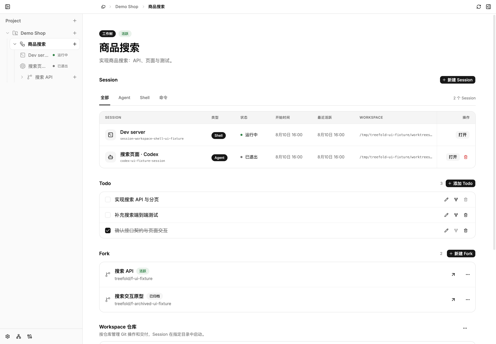
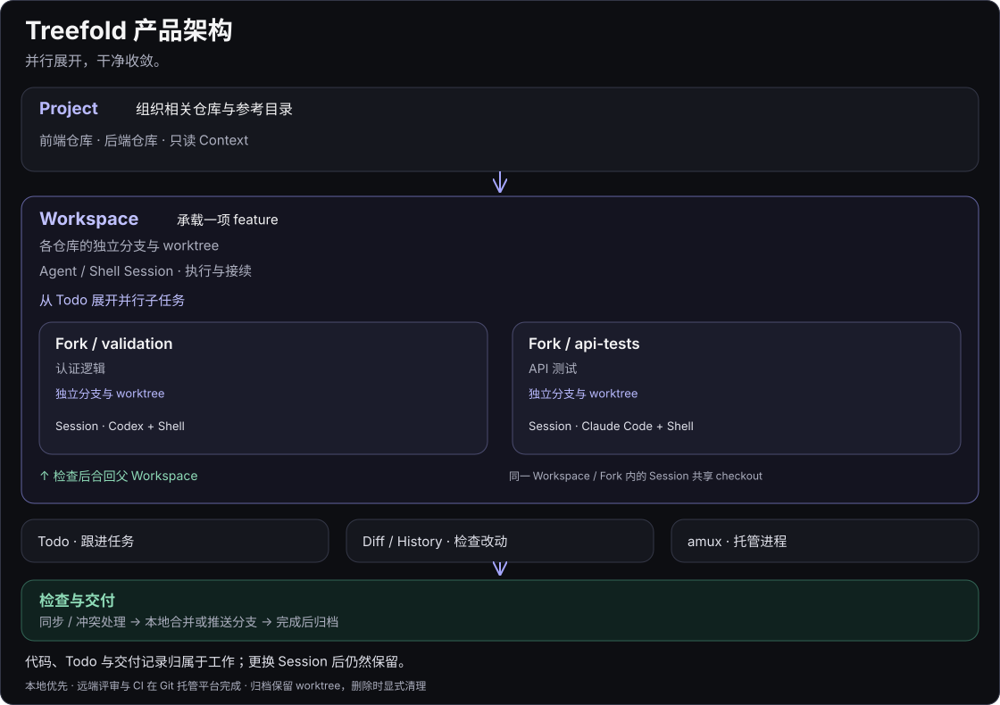
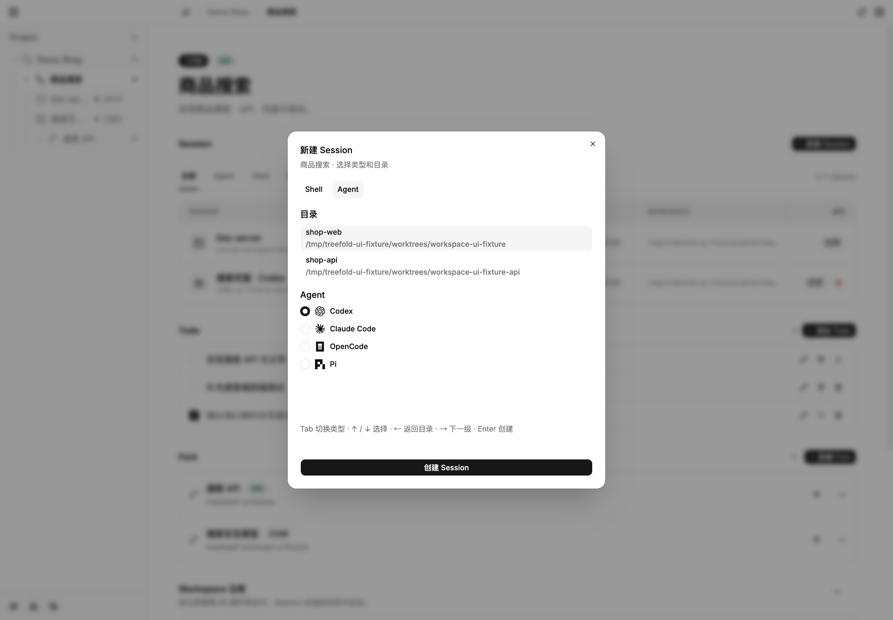

# Treefold for macOS

**简体中文** | [English](README.en.md)

**并行展开，干净收敛。**

Treefold 是一个本地优先的 macOS App，让你在独立的 Git worktree 中并行运行 AI Agent，集中管理代码、终端和任务，再把成果合回主线。

用你熟悉的 **Codex、Claude Code、OpenCode 或 Pi** 开发，用 Shell 启动服务和运行测试。每项 feature 有自己的 Workspace，不必在几个任务之间反复切分支、找终端、回忆进度。

[安装](#安装) · [开始第一个任务](#开始第一个任务) · [常见使用场景](#常见使用场景) · [官网](https://treefold.fffeng566.workers.dev/) · [GitHub Releases](https://github.com/win5do/treefold/releases)



*当前源码的 App 界面，使用示例数据；发布版界面可能有所不同。*

## Treefold 能帮你做什么

- **同时推进多项 feature**：每个 Workspace 使用独立分支和 worktree，保留原有工作现场。
- **拆分并行子任务**：在 Workspace 下创建 Fork，让不同 Agent 分别负责 API、页面或测试，再合回父 Workspace。
- **找回工作上下文**：代码、Agent 和 Shell Session、Todo 都跟着任务走。切换页面不会停止进程；已关联原生历史的 Agent Session 可以恢复。
- **检查并交付成果**：查看 diff 和 Git 历史，处理同步与冲突，选择本地合并或推送分支，完成后归档，按需清理。
- **组织多个仓库**：在一个 Project 中放入前后端仓库及参考文档，明确各目录的读写用途。

## 产品架构

Project 组织相关仓库，Workspace 承载一项 feature，Fork 将子任务放进独立 worktree。Agent 与 Shell Session 执行工作；检查 Fork 成果后合回父 Workspace，再交付整项 feature。



隔离发生在 Workspace / Fork 层级；同一项工作中的 Session 共享 checkout。更换 Session 后，代码、Todo 与交付记录仍然保留。

## 安装

需要 **Apple Silicon Mac、macOS Sonoma 14 或更新版本，以及 Git**。

### Homebrew

```bash
brew install --cask win5do/tap/treefold
```

安装后从“应用程序”打开 Treefold。后续更新：

```bash
brew update
brew upgrade --cask treefold
```

### 下载安装包

前往 [GitHub Releases](https://github.com/win5do/treefold/releases)，下载 Apple Silicon 的 `.dmg`，打开后将 Treefold 拖入“应用程序”。Release 页面同时提供 ZIP、SHA-256 校验文件和版本说明。

当前发布版本为 **0.1.0-alpha.1**，使用 ad-hoc 签名，尚未经过 Apple 公证。首次打开如果被 macOS 阻止，请在“系统设置 → 隐私与安全性”中选择“仍要打开”，然后按提示确认。

### 准备你要使用的 Agent

Treefold 调用本机的 Agent CLI。先安装并完成相应 CLI 的登录或模型配置，确认它能在终端中正常运行；只安装你要用的 Agent 即可。

| Agent | 默认命令 |
| --- | --- |
| Codex | `codex` |
| Claude Code | `claude` |
| OpenCode | `opencode` |
| Pi | `pi` |

在 **设置 → Agent** 中检查检测结果、调整 Agent 顺序，或指定启动命令。安装后未显示时，点击重新检测；自定义安装路径可填写可执行文件的绝对路径。没有配置 Agent 时，也可以独立使用 Shell Session。

四种 Agent 均支持新建 Session 和恢复已关联的原生 Session。恢复依赖已记录的原生 Session ID 及保留的历史；更多集成细节见 [Agent Session 文档](docs/agent-session-metadata.md)。



## 开始第一个任务

第一次使用，先走完 **一个 Project → 一个 Workspace → 一个 Agent Session**，不必马上拆 Fork。

1. **添加 Project**：点击新建 Project，选择已有本地仓库，也可以通过 Git URL 克隆或创建空仓库。选择包含多个仓库的目录时，勾选要加入的仓库和参考目录。
2. **创建 Workspace**：为任务取一个名字，例如“商品搜索”。Treefold 为它准备独立的分支和 worktree，后续开发在这里进行。
3. **启动 Agent**：在 Workspace 中新建 Session，选择 Agent、具体的 CLI 和工作目录，创建后在终端中描述任务。例如：“为商品列表添加搜索，先检查现有接口和测试，再实现并验证。”
4. **运行与检查**：再开一个 Shell Session，按项目需要安装依赖、启动服务或运行测试。在 Treefold 中查看 diff 和 Git 历史，确认改动符合预期。
5. **交付并归档**：打开交付流程，选择合并到 Project 原目录的当前分支，或推送 feature 分支交给远端评审。需要继续开发时使用中间交付；任务结束时选择完成并归档。

完成并归档会停止所属 Session，保留 worktree、分支和工作记录。确认不再需要后，可在删除流程中选择清理或保留工作目录与本地分支。PR 创建、远端评审和 PR 合并在你的 Git 托管平台完成。

## 常见使用场景

### 两项 feature 同时开发

在同一个 Project 下创建“商品搜索”和“订单导出”两个 Workspace，分别启动 Agent。两边使用独立的代码目录和分支，可以各自修改、测试和交付。

同一 Workspace 中的多个 Session **共享代码目录**。需要隔离改动时，创建新的 Workspace 或 Fork；同时运行多个开发服务时，也需要为它们配置不同端口。

### 一项 feature 拆成并行子任务

在“商品搜索”Workspace 中用 Todo 列出 API、页面、测试等工作，将可独立完成的子任务交给 Fork。例如用 Claude Code 实现搜索 API，用 Codex 实现页面。

Fork 从父 Workspace 展开，各自在独立 worktree 中工作。完成后先检查并合回父 Workspace，再联调、运行测试，最后交付整项 feature。先完成所有活跃 Fork，才能完成父 Workspace。

### 隔天继续，或换一个 Agent 接手

回到对应 Workspace 即可找到 Session 和 Todo。运行中的 Session 可以直接打开；停止的 Agent Session 在原生历史可用时通过 Resume 继续。

也可以在同一 Workspace 新建另一个 Agent Session，让它读取现有代码和 Todo 接手。不同 Agent 的聊天历史不会自动互相转换。

## 核心概念

| 概念 | 用途 |
| --- | --- |
| **Project** | 组织相关仓库、参考目录和上下文。 |
| **Workspace** | 承担一项独立的 feature，拥有自己的 worktree、分支、Session 和 Todo。 |
| **Fork** | 承担 Workspace 下的并行子任务，成果合回父 Workspace；不支持嵌套 Fork。 |
| **Session** | 在对应目录中运行 Agent 或 Shell；同一 Workspace 或 Fork 可以拥有多个 Session。 |

## CLI 与 Agent 协作

桌面 App 附带 `treefold` CLI 和 Treefold Skill。受管理的 Agent Session 会获得当前 Project、Workspace、目录和 Todo 的上下文，可以查看任务、领取任务、更新进度并完成 Todo。

```bash
treefold open /path/to/project
treefold current --json
treefold todo list --json
treefold doctor
```

运行 `treefold open .`：已添加的目录直接进入对应 Project；未添加的目录打开本地添加对话框。省略路径时只打开或聚焦 App。

持久进程与终端由配套的 `amux` 管理。Treefold 创建 CLI 与 Skill 链接时，会保留已有的用户自管路径。

## 本地数据与偏好设置

Project 状态、Session 元数据、Todo 和配置保存在本机，核心管理流程无需托管控制服务。Agent 的模型调用、网络访问和费用取决于对应服务及你的配置。

在设置中可以调整语言、主题、Agent 和快捷键。配置位于 `$TREEFOLD_HOME`（默认 `~/.treefold`）：

- `config/settings.toml`：语言、主题与 Agent 默认设置。
- `config/keymap.toml`：快捷键覆盖；省略的绑定使用默认值，`false` 表示禁用。

详见 [配置与快捷键](docs/keymap-configuration.md)。

## 从源码运行

希望体验当前源码中的功能，或参与开发时，准备 stable Rust、Node.js 24.12 或更新版本、Git 和 `just`：

```bash
git clone https://github.com/win5do/treefold.git
cd treefold
npm install
just app-dev
```

开发数据默认存放在仓库的 `.treefold-dev/`，与日常使用的 `~/.treefold` 分开。运行 `just` 查看可用任务，`just build` 生成 macOS App、DMG 与 ZIP。环境配置、构建和验证细节见 [开发指南](AGENTS.md#development-environment-and-commands)。

## 了解更多与反馈

- [Project、Workspace 与 Fork 模型](docs/project-workspace-model.md)
- [Git worktree 生命周期与交付](docs/git-worktree-lifecycle.md)
- [Agent Skill、CLI 与 App API](docs/agent-skill-cli-api-architecture.md)
- [报告问题或提出建议](https://github.com/win5do/treefold/issues)

### 飞书交流群

想交流使用体验、讨论功能或反馈问题，欢迎用飞书扫描下方二维码，加入「Treefold开源项目」群，与我直接沟通。


这是飞书个人版交流群，使用飞书个人账号即可加入。也欢迎通过 [GitHub Issues](https://github.com/win5do/treefold/issues) 交流。

如果 Treefold 对你有帮助，欢迎在 [GitHub 上点个 Star](https://github.com/win5do/treefold)，支持这个开源项目。

## 许可证

Copyright (C) 2026 [win5do](https://github.com/win5do).

Treefold 使用 [GNU Affero General Public License v3.0 only](LICENSE)（AGPL-3.0-only）。
